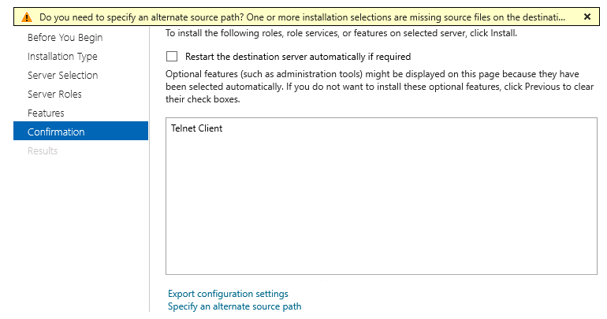

# How to minimize storage footprint of Azure Windows Server

Features on demand allows administrators to remove payloads of unused features from existing Windows Server installations. Next time when you need to install any feature, it will ask for the installation media as source. The below example shows the process for Windows Server 2016 hosted in Microsoft Azure.

```PowerShell
Get-WindowsFeature | Where-Object {$_.InstallState -eq "Available"} | Uninstall-WindowsFeature -Remove

Success Restart Needed Exit Code      Feature Result
------- -------------- ---------      --------------
True    No             Success        {Active Directory Certificate Services, Ac...
```

If you check Telnet Client install State, it shows as **Removed** now.

```PowerShell
PS C:\> Get-WindowsFeature Telnet-Client

Display Name                                            Name                       Install State
------------                                            ----                       -------------
[ ] Telnet Client                                       Telnet-Client                    Removed
```

Next time when you try to install a **removed** feature you will get an error.

```PowerShell
Install-WindowsFeature -Name Telnet-Client
Install-WindowsFeature : The request to add or remove features on the specified server failed.
Installation of one or more roles, role services, or features failed.
The source files could not be found.
Use the "Source" option to specify the location of the files that are required to restore the feature. For more information on specifying a source location, see http://go.microsoft.com/fwlink/?LinkId=243077. Error: 0x800f081f
At line:1 char:1
+ Install-WindowsFeature -Name Telnet-Client
+ ~~~~~~~~~~~~~~~~~~~~~~~~~~~~~~~~~~~~~~~~~~
    + CategoryInfo          : InvalidOperation: (@{Vhd=; Credent...Name=localhost}:PSObject) [Install-WindowsFeature], Exception
    + FullyQualifiedErrorId : DISMAPI_Error__Failed_To_Enable_Updates,Microsoft.Windows.ServerManager.Commands.AddWindowsFeatureCommand

Success Restart Needed Exit Code      Feature Result
------- -------------- ---------      --------------
False   No             Failed         {}
```

In this case you have to specify **-Source** parameter in **Install-WindowsFeature** cmdlet. Or if you are using Server Manager, you will get a warning and option to select an alternative source.



By the way you can check Windows folder size using PowerShell.

```PowerShell
(Get-ChildItem -Path C:\Windows\ -Recurse | Measure-Object Length -Sum).Sum/1GB
```