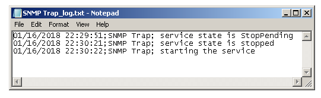

# Monitoring Windows Service

This PowerShell script checks specific Windows Service. If service is in a stopped state script starts it and creates a log file.

## Example

```powershell
.\MonitorWindowsService.ps1 -ServiceName "SNMP Trap" -IntervalSeconds 30
```

Script above checks "SNMP Trap" service every 30 seconds. Any changes to the service state will be logged in “SNMP Trap_log.txt” file.

