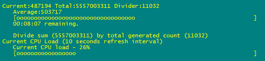

# PowerShell - working with Progress Bar

This PowerShell script generates a number between 0 and 1000000. It calculates an average value, which is surprisingly leading to the middle. SecondsRemaining parameter from Write-Progress cmdlet is reused to show total time used. Additionally CPU load bar is added.



```powershell
$date = Get-Date; $cpudate = Get-Date
$cpuload = (Get-Counter "\\$(hostname)\processor(_total)\% processor time").CounterSamples.CookedValue;
while (1 -match 1) {
$random = Get-Random -Minimum 0 -Maximum 1000000
$divider = $divider + 1; [int64]$total += $random; [int64]$average = $total/$divider
Write-Progress -Id 1 -Activity "Current:$random Total:$total Divider:$divider" -Status "Average:$average" -PercentComplete ([int64]$average/10000) -CurrentOperation "Divide sum ($total) by total generated count ($divider)" -SecondsRemaining ([int64]((Get-Date)-$date).TotalSeconds) -ErrorAction SilentlyContinue
$cputime = Get-Date
if ([int64]($cputime-$cpudate).TotalSeconds -gt 10) {$cpuload = (Get-Counter "\\$(hostname)\processor(_total)\% processor time").CounterSamples.CookedValue; $cpudate = Get-Date}
Write-Progress -Id 2 -Activity "Current CPU Load (10 seconds refresh interval)" -Status "Current CPU load - $($cpuload.ToString("##"))%" -PercentComplete ([int64]$cpuload) -ErrorAction SilentlyContinue
}
```